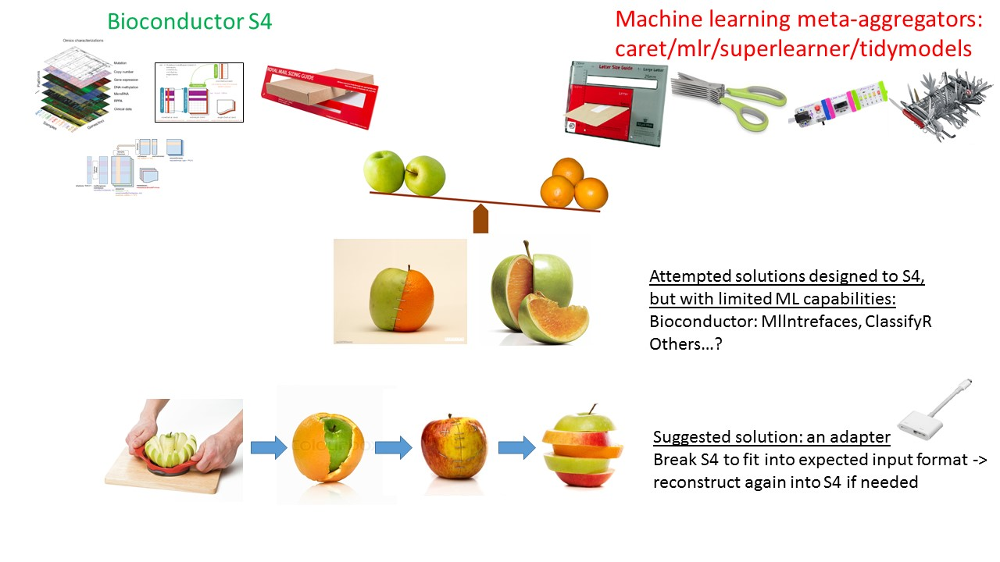

<!-- README.md is generated from README.Rmd. Please edit that file -->

# Bioc2mlr 

R package to bridge between Bioconductor’s S4 complex genomic data
container, to mlr, a meta machine learning aggregator package.

Bioc2mlr is designed to convert Bioconductor S4 assay data containers
summarizedExperiment, MultiAssayExperiment into generalized machnine
learning environment.

Bioconductor’s S4 data containers for genomic assays are popular, well
established data structures. Their data architecture facilitates the
application of common analytical procedures and well established
statistical methodologies to large assay data. They are extensible to
encompass new emerging technologies and analytical methods. However, the
S4 system enforces strict constraints on the data and these constraints
raise barriers for interoperability and integration with software and
packages outside of Bioconductor’s repository.

[mlr](https://mlr.mlr-org.com/) is a comprehensive package for machine
learning. It aggregates hundreds of supervised and unsupervised models
and facilitates analytics such as resampling, benchmarking, tuning, and
ensemble. The [mlrCPO](https://github.com/mlr-org/mlrCPO) package
extends mlr’s pre-processing and feature engineering functionality via
composable Preprocessing Operators (CPO) ‘pipelines’.

Bioc2mlr is a compact utility package designed to bridge between these
approaches. It deploys transformations of
[SummarizedExperiment](http://bioconductor.org/packages/release/bioc/html/SummarizedExperiment.html)
and
[MultiAssayExperiment](http://bioconductor.org/packages/release/bioc/html/MultiAssayExperiment.html)
S4 data structures into mlr’s expected format. It also implements
Bioconductor’s popular feature selection (filtering) methods used by
limma package and others, as a CPO. The vignettes present comparisons to
the
[MLInterfaces](https://bioconductor.org/packages/release/bioc/html/MLInterfaces.html)
package, which aims to achieve similar goals, and presents workflows for
popular publicly available genomic datasets such as
[curatedTCGAData](http://bioconductor.org/packages/release/data/experiment/html/curatedTCGAData.html).

## Vision:

<!-- -->

## Why mlr?

Because it support functional / clustered data.

## What about caret/SuperLearner/tidymodels ?

Sure. Work in progress. keep tuned.  
[caret: Bioc2caret](https://github.com/drorberel/Bioc2caret)  
[SuperLearner:
Bioc2SuperLearner](https://github.com/drorberel/Bioc2SuperLearner)  
[tidymodels:
Bioc2tidymodels](https://github.com/drorberel/Bioc2tidymodels)

## Installation

``` r
# Install development version from GitHub
devtools::install_github("drorberel/Bioc2mlr")

# TBA: Install release version from CRAN
# install.packages("Bioc2mlr")
```

# Current implementations

Two Bioconductor assay container are currently implemented:
[SummarizedExperiment](http://bioconductor.org/packages/release/bioc/html/SummarizedExperiment.html)
for a single assay (though may have multiple sub-assays slots), and
[MultiAssayExperiment](http://bioconductor.org/packages/release/bioc/html/MultiAssayExperiment.html)
for multiple assays. Within the machine-learning framework, the two main
steps that are adapted are the pre-processing step, followed by the
(multivariate) model fitting.

Tools will be demonstrated for each of these 4
combinations.

| S4 assay data container    | Pre-processing (TBA) |   Model (multivariate) |
| -------------------------- | :------------------: | ---------------------: |
| SummarizedExperiment (SE)  |       limmaCPO       |  Fun\_SE\_to\_taskFunc |
| MultiAssayExperiment (MAE) |       UnivCPO        | Fun\_MAE\_to\_taskFunc |

## Usage

[Vignettes](https://github.com/FredHutch/Bioc2mlr/tree/master/vignettes)  
<br>

## Proof of concept demonstration

# Model-evaluation (ML)

## A. SummarizedExperiment (SE)

### Convert raw data from SE S4 class, to mlr’s “task”

``` r
data(Golub_Merge, package = 'golubEsets') # ExpressionSet 
smallG<-Golub_Merge[200:259,]
smallG
#> ExpressionSet (storageMode: lockedEnvironment)
#> assayData: 60 features, 72 samples 
#>   element names: exprs 
#> protocolData: none
#> phenoData
#>   sampleNames: 39 40 ... 33 (72 total)
#>   varLabels: Samples ALL.AML ... Source (11 total)
#>   varMetadata: labelDescription
#> featureData: none
#> experimentData: use 'experimentData(object)'
#>   pubMedIds: 10521349 
#> Annotation: hu6800

library(SummarizedExperiment)
smallG_SE<-makeSummarizedExperimentFromExpressionSet(smallG)

# functional:
task_SE_Functional<-Fun_SE_to_taskFunc(smallG_SE, param.Y.name = 'ALL.AML', param.covariates = NULL, param_positive_y_level = 'ALL', task_return_format = 'functional', task_type = 'classif') ## will work with either 1 or multiple assayS
task_SE_Functional
#> Supervised task: DF_functionals
#> Type: classif
#> Target: ALL.AML
#> Observations: 72
#> Features:
#>    numerics     factors     ordered functionals 
#>           0           0           0           1 
#> Missings: FALSE
#> Has weights: FALSE
#> Has blocking: FALSE
#> Has coordinates: FALSE
#> Classes: 2
#> ALL AML 
#>  47  25 
#> Positive class: ALL

task_train<-task_SE_Functional %>% subsetTask(subset = 1:40)
task_test <-task_SE_Functional %>% subsetTask(subset = 41:72)
classif.lrn = makeLearner("classif.knn")
model<-train(classif.lrn, task_train)
Predict<-model %>% predict(task_test)
Predict %>% calculateConfusionMatrix()
#>         predicted
#> true     ALL AML -err.-
#>   ALL     18   3      3
#>   AML      4   7      4
#>   -err.-   4   3      7
```

## B. MultiAssayExperiment (MAE)

### Convert raw data from MAE S4 class, to mlr’s “task”

``` r
library(MultiAssayExperiment)
miniACC
#> A MultiAssayExperiment object of 5 listed
#>  experiments with user-defined names and respective classes. 
#>  Containing an ExperimentList class object of length 5: 
#>  [1] RNASeq2GeneNorm: SummarizedExperiment with 198 rows and 79 columns 
#>  [2] gistict: SummarizedExperiment with 198 rows and 90 columns 
#>  [3] RPPAArray: SummarizedExperiment with 33 rows and 46 columns 
#>  [4] Mutations: matrix with 97 rows and 90 columns 
#>  [5] miRNASeqGene: SummarizedExperiment with 471 rows and 80 columns 
#> Features: 
#>  experiments() - obtain the ExperimentList instance 
#>  colData() - the primary/phenotype DataFrame 
#>  sampleMap() - the sample availability DataFrame 
#>  `$`, `[`, `[[` - extract colData columns, subset, or experiment 
#>  *Format() - convert into a long or wide DataFrame 
#>  assays() - convert ExperimentList to a SimpleList of matrices
# miniACC %>% sampleMap %>% data.frame %>% dplyr::select(primary, assay) %>% table # no replicates within same assay

task_Functional_MAE<-Fun_MAE_to_taskFunc(miniACC, param.Y.name = 'vital_status', param.covariates = c('gender','days_to_death'), param_positive_y_level = '1', task_type = 'classif')
task_Functional_MAE
#> Supervised task: DF_functionals
#> Type: classif
#> Target: vital_status
#> Observations: 385
#> Features:
#>    numerics     factors     ordered functionals 
#>           1           5           0           5 
#> Missings: TRUE
#> Has weights: FALSE
#> Has blocking: FALSE
#> Has coordinates: FALSE
#> Classes: 2
#>   0   1 
#> 248 137 
#> Positive class: 1

library(bartMachine)
#> Warning: package 'bartMachine' was built under R version 3.5.2
#> Warning: package 'bartMachineJARs' was built under R version 3.5.2
#> Warning: package 'missForest' was built under R version 3.5.2
#> Warning: package 'itertools' was built under R version 3.5.2
#> Warning: package 'iterators' was built under R version 3.5.1
classif_lrn_bartMachine<-makeLearner("classif.bartMachine")
model_bartMachine<-train(classif_lrn_bartMachine, task_Functional_MAE)
#> bartMachine initializing with 50 trees...
#> bartMachine vars checked...
#> bartMachine java init...
#> bartMachine factors created...
#> bartMachine before preprocess...
#> bartMachine after preprocess... 1868 total features...
#> warning: cannot use MSE of linear model for s_sq_y if p > n. bartMachine will use sample var(y) instead.
#> bartMachine sigsq estimated...
#> bartMachine training data finalized...
#> Now building bartMachine for classification ...Covariate importance prior ON. Missing data feature ON. 
#> evaluating in sample data...done
Predict_bartMachine<-model_bartMachine %>% predict(task_Functional_MAE)
Predict_bartMachine %>% calculateConfusionMatrix()
#>         predicted
#> true       0   1 -err.-
#>   0      248   0      0
#>   1        2 135      2
#>   -err.-   2   0      2
```

## Case studies (TBA):

### 1\. CAVDmetaMAE: proof-of-concept example

CAVD dataspace is an online resouce to access and analyze HIV vaccine
experimental assay data. It is annotated, and accessible via either
online tool, and R API DataSpaceR.

The CAVDmetaMAE package implement a hypothesis-free approach, to find
best candidates of immune biomarkers, that are associated with
experimental groups, at each study (separately), and across all studies
together (meta-analysis).

Within each study, immune biomarkers will be analyzed by both single
assays, and combinations across multiple
assays.  
[https://github.com/drorberel/CAVDmetaMAE](https://github.com/drorberel/CAVDmetaMAE "CAVDmetaMAE")  
Private repo. Access permission by request.

<br>
<br>

### 2\. Multi-assay customized feature selection for JDRF data (under review)

#### Data curation

A. NCBI/GEO -\> SEs -\> MAE -\> task (DataPackageR)

#### Paper’s reproducible results

B. Biomarker discovery:  
B.1 Feature selection:  
Fun\_lrn\_univ\_only\_makePrep\_MaG  
Fun\_lrn\_univ\_Clusters\_All\_makePrep\_MaG  
B.2 Sensitivity analysis

#### Customized Multi-assay feature selection

C. (TBA) UnivCPO, UnivClustCPO (refactoring the above
makePreprocWrapper() <br> <br>

### 3\. Annotated public datasets (TBA)

TCGA
[curatedTCGAData](http://bioconductor.org/packages/release/data/experiment/html/curatedTCGAData.html)  
Microbiome
[curatedMetagenomicData](http://bioconductor.org/packages/release/data/experiment/vignettes/curatedMetagenomicData/inst/doc/curatedMetagenomicData.html)  
<br> <br>

### 4\. Customized multi-assay CPOs / composable pipelines (TBA)

Omicade4CPO
[Omicade4](http://bioconductor.org/packages/release/bioc/html/omicade4.html)  
mixomicsCPO
[mixomics](https://cran.r-project.org/web/packages/mixOmics/index.html)  
<br> <br>

### 5\. Analysis Workflows: (TBA)

Utilize MAE to collapse genes to sets/modules/pathways  
Fortified: pheatmaps, ggfortify
